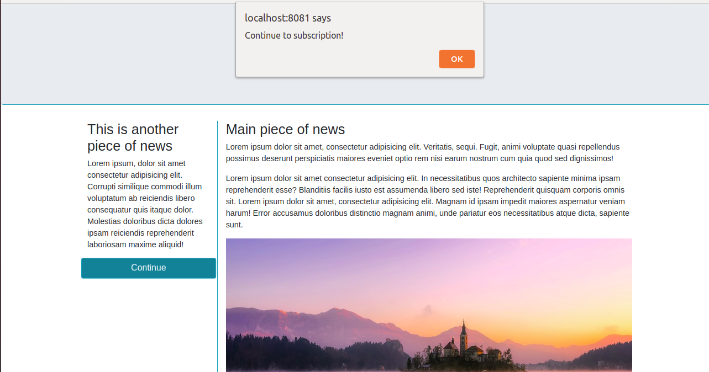

# Async/Await and JS in the Browser Practice

## Instructions

* **Comment out** the promise that handles the modal popup after 10 seconds in `index.js`. Instead, you should try to achieve the same result using `async await` syntax. 
* In `styles.css` there is an animation on the "Continue" button on the page. Create an event listener which listens for the **end of the animation**.
* **Hint:** You may need to research the event type which identifies when an element's animation has finished! It works in the same way as "click", but means the event listener will listen for the end of the element's animation, rather than a click event. :-)
* When the animation ends, the "Continue" button should change its background color to a color of your choice.
* Create two more event listeners - these should fire if the user either (1) right-clicks the "Continue" button, OR (2) double-clicks the "Continue" button.
* If either of these event listeners fire, they should call a function to display an `alert` saying "Continue to Subscription" (**see the below image!**) 
* Create a function which returns a random color. Now make it so that (1) moving your mouse over the `<h2>` element changes its background color to a random color, and (2) resizing your browser window changes the `<h2>` element's **text** color to a random color.

## Bonus

* If you have some extra time, research and play around with different types of event listener. For example, event listeners can listen for different **keyboard events** as well as **mouse events** (like "click"). Try setting some different event listeners to create new functionality in the page! 
* Feel free to also try using at least one more example of `async await` syntax to wait for a set time before creating some effect on the page (like the modal popup after 10 seconds). :-)

